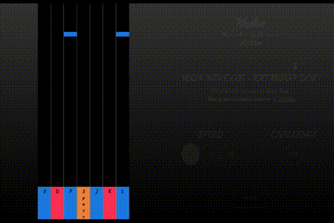

# Rhythm

This is a web-based rhythm game written in HTML, CSS and JavaScript.

The song name is Kataware Doki from Anime "Your Name" (君の名は ー 片割れ時).
The original song is written by Yojiro Noda. The piano synthesia version in
this game is composed by [Theishter](http://www.theishter.com).
The note animation is hard-coded.

## Getting Started

It is recommended to play this game on Google Chrome.

Visit [this page](https://chloeliang.github.io/rhythm-game/) to play the game.

## Contributing

When contributing to this repository, please first discuss the change you wish to
make via issue, email, or any other method with the owners of this repository
before making a change.

## License

This project is licensed under the MIT License - see the [LICENSE](LICENSE) file for details.
